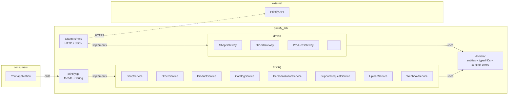

# printify-golang-sdk

> **Version:** `v0.0.1-alpha` — pre-release; the API surface may change between alpha tags.

An idiomatic, **stdlib-only** Go client for the [Printify](https://printify.com) REST API. The library follows [hexagonal (ports & adapters) architecture](https://en.wikipedia.org/wiki/Hexagonal_architecture_(software)) and ships with **100 % unit-test coverage** of every service, verified by the race detector on every commit.

---

## Highlights

| Property | Detail |
|---|---|
| **Go** | 1.26+ (declared in `go.mod`) |
| **Dependencies** | **None** — the standard library only |
| **Typed IDs** | Every identifier is a strongly-typed wrapper (`domain.ShopID`, `domain.OrderID`, …) so a `ShopID` can never be passed where a `ProductID` is expected. |
| **Context-first** | Every I/O method takes `context.Context` as its first argument. |
| **Sentinel errors** | A small, stable set of errors checked with `errors.Is` — no string matching, no unwrapping acrobatics. |
| **Tested** | 100 % service coverage, hand-written stub gateways (no mocking framework), `-race` enabled. |
| **Versioned** | [Semantic Versioning 2.0](https://semver.org/); the version is baked into the `User-Agent` of every request. |

---

## Table of contents

- [Architecture](#architecture)
- [Project layout](#project-layout)
- [Installation](#installation)
- [Quick start](#quick-start)
- [Configuration](#configuration)
- [Error handling](#error-handling)
- [Pagination](#pagination)
- [Service reference](#service-reference)
- [Development](#development)
- [Contributing](#contributing)
- [Continuous integration &amp; release](#continuous-integration--release)
- [Versioning &amp; release policy](#versioning--release-policy)
- [License](#license)

---

## Architecture

The SDK is organised as a textbook hexagonal (a.k.a. "clean" / "ports & adapters") system:



Rules (enforced by the linter and code review):

1. **`domain/` is the core.** No imports from `services/`, `adapters/`, or `ports/`. Pure Go data types, typed IDs, and sentinel errors.
2. **`ports/driving/` is the public API.** These interfaces are what consumers see. The `SDK` struct in `printify.go` exposes them as fields.
3. **`services/` contains all business logic and validation.** No HTTP, no JSON, no I/O. 100 % unit-testable.
4. **`ports/driven/` are the outbound interfaces the services need** (the "gateways").
5. **`adapters/rest/` implements the driven ports over HTTPS/JSON.** Private DTOs with `json` tags live here only — `domain/` types carry no transport tags.
6. **`printify.go` is wiring only.** It constructs adapters, feeds them into services, and exposes the result. It has no logic and no tests of its own.

The full set of rules is in [`.agents/`](.agents/):

- [`.agents/architecture.md`](.agents/architecture.md) — dependency rule, layout
- [`.agents/go-style.md`](.agents/go-style.md) — Go idioms, error wrapping, typing
- [`.agents/testing.md`](.agents/testing.md) — testing standards

---

## Project layout

```
.
├── api/
│   └── openapi.yaml           # Source of truth for the Printify API contract
├── pkg/printify/
│   ├── printify.go            # Public facade: New(Config) + service fields
│   ├── domain/                # Entities, value objects, typed IDs, sentinel errors
│   │   ├── catalog.go
│   │   ├── errors.go
│   │   ├── ids.go
│   │   ├── order.go
│   │   ├── personalization.go
│   │   ├── product.go
│   │   ├── shop.go
│   │   ├── support_request.go
│   │   ├── upload.go
│   │   └── webhook.go
│   ├── ports/
│   │   ├── driven/            # Gateway interfaces (implementation detail)
│   │   └── driving/           # Service interfaces (the public API)
│   ├── services/              # Business logic + validation (100 % tested)
│   └── adapters/rest/         # HTTP transport, JSON (de)serialisation, errors
├── .agents/                   # Internal engineering standards (see above)
├── .github/workflows/         # CI (ci.yml) + release (release.yml)
├── .gitignore
├── LICENSE
├── Makefile                   # build / vet / fmt / lint / test / check
├── go.mod                     # module github.com/printify-go
├── openapi.json               # Machine-readable API spec (legacy copy)
└── README.md
```

---

## Installation

The SDK is a regular Go module with **zero external dependencies**.

```bash
go get github.com/printify-go/pkg/printify@latest
```

To pin to this pre-release:

```bash
go get github.com/printify-go/pkg/printify@v0.0.1-alpha
```

---

## Quick start

Create a client with your personal access token, then call the service you need. Services are **exported fields** on the `SDK` struct.

```go
package main

import (
    "context"
    "errors"
    "fmt"
    "log"

    printify "github.com/printify-go/pkg/printify"
    "github.com/printify-go/pkg/printify/domain"
)

func main() {
    sdk, err := printify.New(printify.Config{
        APIToken: "YOUR_PRINTIFY_TOKEN", // required
        // BaseURL:    "https://api.printify.com", // optional; defaults to production
        // HTTPClient: customHTTP,                  // optional; defaults to http.DefaultClient
    })
    if err != nil {
        log.Fatalf("constructing SDK: %v", err)
    }

    ctx := context.Background()

    // 1. List the Printify shops attached to the token.
    shops, err := sdk.Shops.ListShops(ctx)
    if err != nil {
        log.Fatalf("listing shops: %v", err)
    }
    for _, s := range shops {
        fmt.Printf("shop %d: %q via %s\n", s.ID, s.Title, s.Channel)
    }
    if len(shops) == 0 {
        fmt.Println("no shops connected")
        return
    }
    shop := shops[0]

    // 2. List the first page of orders in that shop.
    page, limit := 1, 25
    orders, err := sdk.Orders.List(ctx, shop.ID, printify.OrderFilter{
        Limit: &limit,
        Page:  &page,
    })
    if err != nil {
        if errors.Is(err, domain.ErrNotFound) {
            fmt.Println("shop not found")
            return
        }
        log.Fatalf("listing orders: %v", err)
    }
    fmt.Printf("fetched %d orders (page %d)\n", len(orders), page)
}
```

---

## Configuration

`printify.New(cfg)` accepts a single `Config` value:

| Field | Required | Default | Notes |
|---|---|---|---|
| `APIToken` | ✅ | — | Printify personal access token. Returned as an error if empty. Sent as `Authorization: Bearer <token>`. |
| `BaseURL` | — | `https://api.printify.com` | Override for staging, tests, or self-hosted mocks. |
| `HTTPClient` | — | `http.DefaultClient` | Bring your own `*http.Client` for timeouts, TLS, or middleware. |

There are **no environment-variable lookups** — the token is always passed in `Config`. This keeps the SDK predictable when used inside larger systems.

Every request is tagged with `User-Agent: printify-golang-sdk/<version>`. The version is baked in at build time and overridable:

```bash
go build -ldflags "-X github.com/printify-go/pkg/printify/adapters/rest.UserAgentVersion=vX.Y.Z"
```

---

## Error handling

All user-facing failure modes surface as a small set of **sentinel errors** defined in `pkg/printify/domain/errors.go`. Use the standard library to discriminate them:

```go
import (
    "errors"

    "github.com/printify-go/pkg/printify/domain"
)

switch {
case errors.Is(err, domain.ErrInvalidInput):
    // caller passed a bad argument — do not retry
case errors.Is(err, domain.ErrNotFound):
    // the remote returned 404
case errors.Is(err, domain.ErrUnauthorized):
    // the remote returned 401/403 — token missing, expired, or not permitted
case errors.Is(err, domain.ErrConflict):
    // the remote returned 409
default:
    // unexpected transport / API failure — inspect and decide
}
```

| Sentinel | Meaning |
|---|---|
| `domain.ErrInvalidInput` | A parameter failed local validation (empty ID, empty payload, malformed limit, …). |
| `domain.ErrNotFound` | The remote returned `404`. |
| `domain.ErrUnauthorized` | The remote returned `401` or `403`. |
| `domain.ErrConflict` | The remote returned `409`. |

Errors are **safe to share across goroutines**, are returned by value, and remain matchable by `errors.Is` after being wrapped with `fmt.Errorf("...: %w", err)`.

---

## Pagination

List methods that support paging expose a filter struct with `Limit` and `Page` as **pointer fields**, so you can distinguish "unspecified" from "zero":

```go
page, limit := 1, 50
orders, err := sdk.Orders.List(ctx, shop.ID, printify.OrderFilter{
    Limit: &limit,
    Page:  &page,
})
```

Pass `nil` to use the API default. The same shape (`*int` for `Limit`/`Page`) is used by `ProductFilter`, `UploadFilter`, and `WebhookFilter`.

---

## Service reference

The `SDK` struct exposes the following services as **exported fields**:

| Field | Purpose |
|---|---|
| `sdk.Shops` | List or disconnect Printify shops. |
| `sdk.Catalog` | Blueprints, size guides, print providers, variants, shipping — global (no shop param). |
| `sdk.Products` | CRUD, publish/unpublish, GPSR info. |
| `sdk.Orders` | List / get / submit / express / cancel / send-to-production / shipping / address changes. |
| `sdk.Personalization` | List personalization options, create config, run and poll preview tasks. |
| `sdk.SupportRequests` | List / get reprint &amp; refund requests for an order. |
| `sdk.Uploads` | List / get / archive images, upload a new image. |
| `sdk.Webhooks` | Manage webhook subscriptions and simulate deliveries. |

### `sdk.Shops`

```go
ListShops(ctx context.Context) ([]domain.Shop, error)
DisconnectShop(ctx context.Context, id domain.ShopID) error
```

### `sdk.Catalog`

```go
ListBlueprints(ctx) ([]domain.Blueprint, error)
GetBlueprint(ctx, id domain.BlueprintID) (*domain.Blueprint, error)
GetSizeGuide(ctx, id domain.BlueprintID) (*domain.SizeGuide, error)
ListPrintProviders(ctx) ([]domain.PrintProvider, error)
GetPrintProvider(ctx, id domain.PrintProviderID) (*domain.PrintProvider, error)
ListProvidersForBlueprint(ctx, blueprint domain.BlueprintID) ([]domain.PrintProviderRef, error)
GetVariants(ctx, blueprint domain.BlueprintID, provider domain.PrintProviderID, includeOutOfStock bool) (*domain.Variants, error)
GetShipping(ctx, blueprint domain.BlueprintID) (*domain.BlueprintShipping, error)
GetShippingMethod(ctx, blueprint domain.BlueprintID, method domain.ShippingMethod) (map[string]any, error)
GetShippingV2(ctx, blueprint domain.BlueprintID, provider domain.PrintProviderID) (map[string]any, error)
```

### `sdk.Products`

```go
List(ctx, shop domain.ShopID, f ProductFilter) ([]domain.Product, error)
Get(ctx, shop domain.ShopID, id domain.ProductID) (*domain.Product, error)
Create(ctx, shop domain.ShopID, p domain.CreateProduct) (*domain.Product, error)
Update(ctx, shop domain.ShopID, id domain.ProductID, p domain.UpdateProduct) (*domain.Product, error)
Delete(ctx, shop domain.ShopID, id domain.ProductID) error
Publish(ctx, shop domain.ShopID, id domain.ProductID, opts domain.PublishProduct) error
Unpublish(ctx, shop domain.ShopID, id domain.ProductID) error
SetPublishSucceeded(ctx, shop domain.ShopID, id domain.ProductID, ext domain.PublishSucceeded) error
SetPublishFailed(ctx, shop domain.ShopID, id domain.ProductID, reason string) error
ListGpsr(ctx, shop domain.ShopID, id domain.ProductID) ([]domain.GpsrInfo, error)
```

`ProductFilter{ Limit *int; Page *int }`.

### `sdk.Orders`

```go
List(ctx, shop domain.ShopID, f OrderFilter) ([]domain.Order, error)
Get(ctx, shop domain.ShopID, id domain.OrderID) (*domain.Order, error)
Submit(ctx, shop domain.ShopID, o domain.SubmitOrder) (*domain.OrderIDResult, error)
SubmitExpress(ctx, shop domain.ShopID, o domain.ExpressOrder) ([]map[string]any, error)
Cancel(ctx, shop domain.ShopID, id domain.OrderID) (*domain.Order, error)
SendToProduction(ctx, shop domain.ShopID, id domain.OrderID) (*domain.OrderIDResult, error)
CalculateShipping(ctx, shop domain.ShopID, o domain.SubmitOrder) (*domain.ShippingCosts, error)
ChangeAddress(ctx, shop domain.ShopID, id domain.OrderID, a domain.AddressChange) (*domain.AddressChangeResult, error)
```

`OrderFilter{ Limit *int; Page *int; Status string; SKU string }`.

### `sdk.Personalization`

```go
ListOptions(ctx, shop domain.ShopID, product domain.ProductID) ([]domain.PersonalizationOption, error)
CreateConfig(ctx, shop domain.ShopID, product domain.ProductID, cfg domain.CreatePersonalizationConfig) (*domain.PersonalizationConfig, error)
CreatePreviewTask(ctx, shop domain.ShopID, product domain.ProductID, task domain.CreatePreviewTask) (*domain.PreviewTask, error)
GetPreviewTask(ctx, shop domain.ShopID, product domain.ProductID, id domain.TaskID) (*domain.PreviewTask, error)
```

### `sdk.SupportRequests`

```go
List(ctx, shop domain.ShopID, order domain.OrderID) ([]domain.SupportRequest, error)
Get(ctx, shop domain.ShopID, order domain.OrderID, id domain.SupportRequestID) (*domain.SupportRequest, error)
RequestReprint(ctx, shop domain.ShopID, order domain.OrderID, r domain.ReprintRequest) (*domain.SupportRequest, error)
RequestRefund(ctx, shop domain.ShopID, order domain.OrderID, r domain.RefundRequest) (*domain.SupportRequest, error)
```

Validation limits: description ≤ 400 chars, ≤ 5 image URLs, ≥ 1 line item, each line item `Quantity ≥ 1`.

### `sdk.Uploads`

```go
List(ctx, f UploadFilter) ([]domain.Upload, error)
Get(ctx, id domain.UploadID) (*domain.Upload, error)
UploadImage(ctx, img domain.UploadImage) (*domain.Upload, error)
Archive(ctx, id domain.UploadID) error
```

`UploadImage` requires either `URL` **or** `Contents` to be set (exactly one).

### `sdk.Webhooks`

```go
List(ctx, shop domain.ShopID, f WebhookFilter) ([]domain.Webhook, error)
Create(ctx, shop domain.ShopID, topic domain.WebhookTopic, url string) (*domain.Webhook, error)
Modify(ctx, shop domain.ShopID, id domain.WebhookID, url string) (*domain.Webhook, error)
Delete(ctx, shop domain.ShopID, id domain.WebhookID, host string) (domain.WebhookID, error)
Simulate(ctx, shop domain.ShopID, id domain.WebhookID) error
```

Topic constants (in `domain/webhook.go`):

- `TopicShopDisconnected`
- `TopicProductDeleted`, `TopicProductCreated`, `TopicProductUpdated`, `TopicProductPublishStarted`
- `TopicOrderCreated`, `TopicOrderUpdated`, `TopicOrderShipmentCreated`, `TopicOrderShipmentDelivered`, `TopicOrderSentToProduction`
- `TopicPersonalizationPreviewProcessed`
- `TopicSupportRequestUpdated`

---

## Development

This repository uses `make` for every quality gate. The toolchain auto-installs `golangci-lint v2.14.0` on first run (a pinned version, so CI and local dev stay in lock-step).

```bash
make build        # go build ./...
make vet          # go vet ./...
make fmt          # gofmt -w .
make fmt-check    # gofmt -l (must be empty)
make lint         # golangci-lint run ./...
make test         # go test ./... -race -cover
make check        # build + vet + fmt-check + lint + test
```

`make check` is the **single source of truth** for "is the code healthy?" — it is exactly what CI runs.

### Testing philosophy

- **Every service must have unit tests.** A new service or service method without tests must not be merged (see [`.agents/testing.md`](.agents/testing.md)).
- **Unit tests never hit the network.** Driven ports are replaced with hand-written stub gateways defined in the `_test.go` file — no third-party mocking frameworks.
- **Table-driven tests with named cases.** One subtest per input shape, covering happy path, every validation failure, and gateway error propagation.
- **100 % service coverage is the bar.** `make test` runs with `-race` and reports per-package coverage.

---

## Contributing

Pull requests are welcome. Before submitting:

1. Run `make check` locally and ensure it is green.
2. Follow the conventions in [`.agents/`](.agents/):
   - [Architecture rules](.agents/architecture.md)
   - [Go style](.agents/go-style.md)
   - [Testing standards](.agents/testing.md)
3. Keep the public surface small: consumers interact only via `printify.New(...)` and the `ports/driving` interfaces.
4. Prefer the standard library. Adding a third-party dependency requires a strong justification in the PR description.
5. Open the PR against `main` (or `master`); CI will run the full quality gate and block the merge if any step fails.

### Commit & tag discipline

- Commits should be focused and descriptive. Conventional-Commits-style prefixes (`feat:`, `fix:`, `docs:`, `test:`, `chore:`) are recommended (not enforced) so the release tooling can group changes later.
- **Tags are the release mechanism.** A release happens when a maintainer pushes a tag of the form `vX.Y.Z` (optionally with a pre-release suffix: `vX.Y.Z-alpha`, `vX.Y.Z-beta.1`, `vX.Y.Z-rc.2`).

---

## Continuous integration &amp; release

Two GitHub Actions workflows live in [`.github/workflows/`](.github/workflows/):

### `ci.yml`

Runs on every push to `main`/`master`, on every pull request, and on `v*` tags:

1. `go mod tidy` stability check (rejects if the manifest drifts).
2. `go build` with the version baked in from the ref name.
3. `go vet`.
4. `gofmt -l` — rejects unformatted files.
5. `golangci-lint v2.14.0`.
6. `go test ./... -race -cover -coverprofile=coverage.out`.
7. Uploads `coverage.out` as an artifact.

Concurrent runs on the same ref are **cancelled in progress** so a stale PR doesn't keep burning runners.

### `release.yml`

Triggered by a `vX.Y.Z[-prerelease]` tag (or manually via `workflow_dispatch`):

1. **Validates** the tag is a well-formed semantic version.
2. Re-runs the **entire CI quality gate** on the tagged commit (build, vet, fmt, lint, test).
3. Generates a `CHANGELOG.md` for the release.
4. Publishes a **GitHub Release** via [`softprops/action-gh-release`](https://github.com/softprops/action-gh-release) (auto-flagged as a pre-release when the tag contains `-`).
5. Pre-warms the Go module proxy so the first `go get` of the new version is fast.

### Cutting a release

```bash
# after merging the changes to main
git checkout main
git pull
git tag v0.0.1-alpha          # or v0.1.0, v1.0.0-rc.1, ...
git push origin v0.0.1-alpha
```

That's it — the `release.yml` workflow takes it from there.

---

## Versioning &amp; release policy

This SDK follows [Semantic Versioning 2.0](https://semver.org/):

- **MAJOR** — incompatible API changes (removed/renamed methods, changed signatures, altered error semantics).
- **MINOR** — new functionality added in a backward-compatible manner (new services, new methods, new optional fields on filter structs).
- **PATCH** — backward-compatible bug fixes.

Pre-releases are tagged `vX.Y.Z-alpha`, `vX.Y.Z-beta`, `vX.Y.Z-rc.1`, etc. **The current version is `v0.0.1-alpha`** — the API is stabilising and may change between alpha tags. Pin your dependency to a specific tag (see [Installation](#installation)) until a `v1.0.0` is released.

The version constant is `UserAgentVersion` in [`pkg/printify/adapters/rest/client.go`](pkg/printify/adapters/rest/client.go). It is overridable at build time:

```bash
go build -ldflags "-X github.com/printify-go/pkg/printify/adapters/rest.UserAgentVersion=v1.2.3"
```

---

## License

[MIT](LICENSE)
